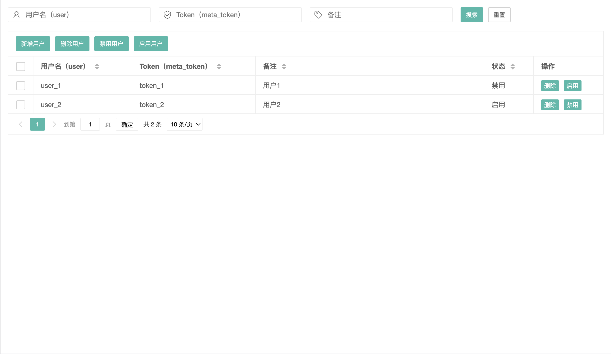
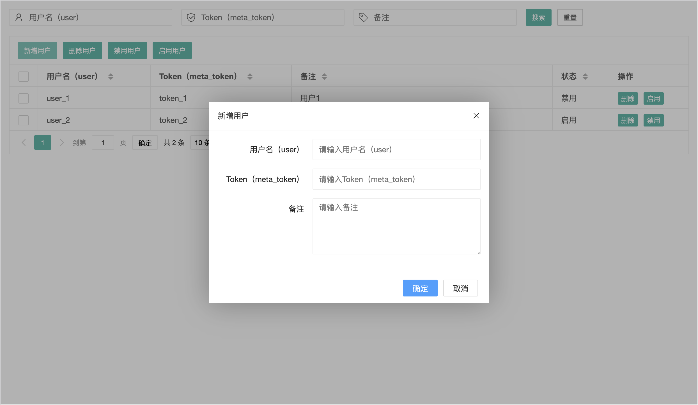
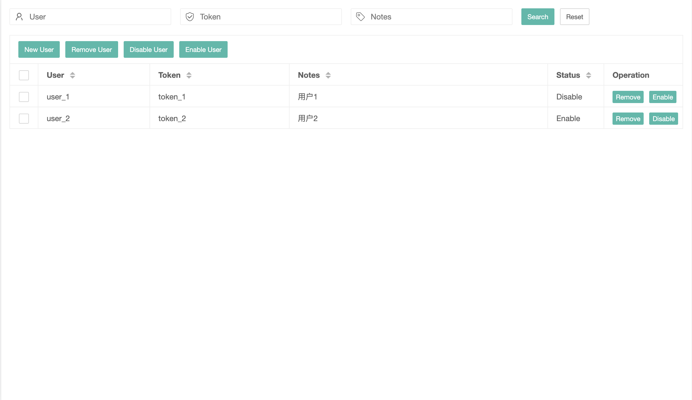

# frps-multiuser

frp server plugin to support multiple users for [frp](https://github.com/fatedier/frp).

frps-multiuser will run as one single process and accept HTTP requests from frps.





## update notes

+ **the default tokens file is frps-multiuser.ini now,ini file support comment**
+ **remove `-l`,it configure in `frps-multiuser.ini` now**
+ **change `-f` to `-c`,the same as `frps`**
+ **if \[users\] section is empty,the authentication will only be handle by frps**
+ **if user under \[disabled\] section ,and the value is `disable`, it means that user is be disabled, and can not connect to server**
+ **you can dynamic `add`,`remove`,`disable` or `enable` user now**

***an user dynamic `remove` or `disable`,it will take some time to be effective***

[README](README.md) | [中文文档](README_zh.md)

### Features

* Support multiple user authentication by tokens saved in file.

### Download

Download frps-multiuser binary file from [Release](../../releases).

### Requirements

frp version >= v0.31.0

### Usage

1. Create file `frps-multiuser.ini` including all support usernames and tokens.

```ini
[common]
;plugin listen ip
plugin_addr = 127.0.0.1
;plugin listen port
plugin_port = 7200
;user and passwd for basic auth protect
admin_user  = admin
admin_pwd   = admin

[users]
;user1
user1 = 123
;user2
user2 = abc

[disabled]
;user2 is disable
user2 = disable
```

   One user each line. Username and token are split by `=`.

2. Run frps-multiuser:

   `./frps-multiuser -c ./frps-multiuser.ini`

3. Register plugin in frps.

```ini
# frps.ini
[common]
bind_port = 7000

[plugin.multiuser-login]
addr = 127.0.0.1:7200
path = /handler
ops = Login

[plugin.multiuser-new-work-conn]
addr = 127.0.0.1:7200
path = /handler
ops = NewWorkConn

[plugin.multiuser-new-user-conn]
addr = 127.0.0.1:7200
path = /handler
ops = NewUserConn

[plugin.multiuser-new-proxy]
addr = 127.0.0.1:7200
path = /handler
ops = NewProxy

[plugin.multiuser-ping]
addr = 127.0.0.1:7200
path = /handler
ops = Ping
```

4. Specify username and meta_token in frpc configure file.

   For user1:

```ini
# frpc.ini
[common]
server_addr = x.x.x.x
server_port = 7000
user = user1
meta_token = 123

[ssh]
type = tcp
local_port = 22
remote_port = 6000
```

   For user2:(user2 can't connect to server,because it is disable)

```ini
# frpc.ini
[common]
server_addr = x.x.x.x
server_port = 7000
user = user2
meta_token = abc

[ssh]
type = tcp
local_port = 22
remote_port = 6000
```
